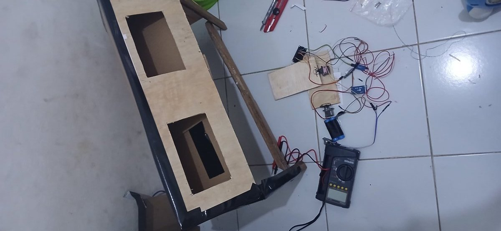

# IoT Web Monitoring — Smart Poultry House

Sistem monitoring + kontrol kandang ayam end-to-end: ESP32 → MQTT → Backend → MongoDB → Dashboard web + 3D.

Mahasiswa Pendidikan Fisika — fokus fisika terapan: termodinamika mikroklimat kandang, kalibrasi sensor, dan kontrol ventilasi hemat energi. Roadmap: edge ML lokal (prediksi + deteksi anomali THI).

## Demo
- Video web + dashboard: https://www.instagram.com/reel/DeCfE8qSaa0/
- Dashboard live: `https://iot-pulse-monitor.vercel.app` (frontend) + `https://iot-backend.onrender.com/api` (cek `"demoMode": false`)
- Lokal: `http://localhost:4000`

## Prototype


## Arsitektur
```
ESP32 (DHT22 + MQ-135 + IR pakan + 2x servo atap)
  → MQTT (EMQX / Mosquitto lokal :1883)
  → Backend Node.js (Express + Socket.IO, subscribe iot/device/+/data)
  → MongoDB (Atlas / lokal) → Dashboard web + 3D (Socket.IO real-time)
  → Perintah balik web → ESP32 (topik .../cmd: buka/tutup atap, auto/manual)
```

## Fitur
- Real-time suhu, kelembapan, gas amonia (ppm), status pakan, sudut atap
- Grafik historis + alert otomatis (suhu > 35°C, gas > 25 ppm, pakan habis)
- Kontrol atap servo dari web (auto hysteresis 28/31°C + manual override 10 mnt)
- Multi-device, auth JWT, mode demo kalau DB/MQTT mati

## Hardware (prototype jadi)
- ESP32 DevKit + DHT22 + MQ-135 + IR FC-51 + 2x MG90S — lihat `firmware/esp32-kandang-lengkap/` (wiring di README firmware, tinggal colok, tanpa PCB custom)

## Quick Start (lokal)
```powershell
.\scripts\setup.ps1
.\scripts\start-all.ps1
node scripts\publish-test.js   # terminal baru, tes tanpa ESP32
# buka http://localhost:4000
.\scripts\stop-all.ps1
```
Syarat: Node.js 18+, Mosquitto, MongoDB (atau Docker: `docker-compose up -d`).

## Struktur
```
backend/    # Express + MQTT subscriber + Socket.IO + Mongo models
frontend/   # dashboard (v10.html utama) + 3D kandang
firmware/   # esp32-kandang-lengkap (dipakai) + varian lain
scripts/    # setup, start/stop, simulasi device, seed
docs/       # dokumentasi lengkap
```

## Roadmap (ke S2 Teknik Elektro — Edge ML)
1. Logging 2–4 minggu di kandang asli (interval 5 dtk)
2. Training di laptop → export ONNX/TFLite (prediksi suhu + anomali THI)
3. Inference pindah ke single-board computer di kandang (Orange Pi Zero 2W / RPi, offline-first) — laptop saat ini sebagai edge sementara, tanpa ubah kode
4. Uji A/B: rule reaktif vs ML prediktif → paper

## Kontak kolaborasi
Terbuka untuk bimbingan/kolaborasi riset IoT + edge ML (corresponding author dipersilakan). Hubungi via email GitHub profile.

## Lisensi
MIT © 2026 Rafi Praja Syahputra — lihat `LICENSE`.
